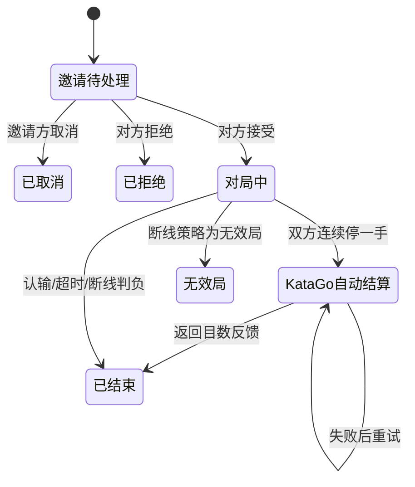

# 围棋中心与问题反馈功能说明（0.2.0 Demo）

## 产品边界

0.2.0 的目标是让已有 Polynomial Server 账号直接使用围棋研究、题库、人机和双人协作功能，同时保留管理员对规则与资源的高自由度。管理员负责预设、权限、题库和异步反馈，不承担实时在线、判棋或争议仲裁义务。

正式对局在双方连续停一手后进入自动结算阶段。服务器调用 KataGo 的 `kata-search_analyze`，以 `scoreLead` 目数反馈统一判定胜负；玩家不再标记死子或提交数目方案。结算失败时保留棋局并允许参与者重试，不存在“请求管理员裁决”流程。

## 用户模式

| 分类 | 模式 | 0.2.0 范围 | 持久化 |
|---|---|---|---|
| 单人 | 自由研究 | 规则落子或自由摆棋；自动轮换/指定黑白/擦除；提子、禁入和劫校验；撤销、重做、停一手、清盘；变化分支、标题、评论 | 按账号保存研究树；支持 SGF 导入 |
| 单人 | 题库 | 管理员发布初始局面、目标、提示、难度、标签和多分支答案树；服务器验证答案，不把答案树下发给用户 | 保存最近 10,000 次作答结果 |
| 单人 | 人机对弈 | 调用服务器本地 KataGo；可选棋盘、规则、劫规则、颜色/随机、让子、贴目、计时、悔棋与难度 | 自动记录；查看终局与步骤、导出 SGF |
| 多人 | 联机对战 | 向有权限且接受邀请的账号发送邀请；接受/拒绝/取消；服务器权威校验落子、计时、提子、劫、悔棋、认输、双停和数目 | 自动记录；双方查看终局与步骤、导出 SGF |
| 多人 | 共享棋盘 | 两人自由摆黑/白、擦除、撤销、重做；房主可清空或锁定 | 共享操作实时保存 |

## 联机棋局生命周期



每局在接受邀请时冻结参数。之后管理员调整默认值不会改动进行中的棋局。

## 规则与结果

- 标准棋盘：9、13、19 路，可由管理员限制允许列表。
- 计分：默认中国规则；管理员可选择开放日本规则。Demo 对复杂劫争、双活与特殊日本规则判例不提供人工裁决，推荐公开测试阶段使用中国规则。
- 劫：全局同形禁着或简单劫。
- 自杀：0.2.0 固定禁止。
- 让先：通过双方颜色选择或随机颜色实现。
- 让子：2–9 子使用标准星位；让子后白先。
- 终局：认输 `+R`、超时 `+T`、断线判负 `+F`，或双方确认后按目数产生结果。
- 棋谱范围：仅创建者、双方参与者、公开。公开棋谱只在结束后可查看。

## 账号权限

| 权限 | 作用 |
|---|---|
| `accessGames` | 既有小游戏总开关 |
| `accessGo` | 进入围棋中心总开关 |
| `goStudy` | 新建、保存、读取和删除自由研究 |
| `goPuzzles` | 查看题库和提交答案 |
| `goAi` | 创建 KataGo 人机棋局 |
| `goMultiplayer` | 参加联机对战或共享房间 |
| `goInvite` | 主动发送邀请 |
| `goShared` | 创建/接受并编辑共享棋盘 |
| `goSgfImport` | 将 SGF 导入个人研究 |
| `goSgfExport` | 下载有权查看的正式棋谱 |

权限彼此独立。例如没有研究权限但有题库权限的用户仍可进入围棋中心做题。管理员账号参加棋局时只是一名普通参与者，没有额外落子、改结果或裁决能力。

## 管理员可修改参数

| 分组 | 参数 |
|---|---|
| 功能状态 | 围棋开放/维护、人机开放/关闭 |
| 规则 | 允许棋盘、默认棋盘、允许/默认计分规则、允许/默认劫规则、默认贴目、让子贴目、最大让子数 |
| 悔棋与棋谱 | 默认悔棋策略、每人成功悔棋次数、棋谱默认可见范围 |
| 计时 | 允许计时方式、默认/最大基本时间、默认读秒秒数、默认读秒次数 |
| 邀请与断线 | 邀请有效期、待处理邀请上限、断线策略、断线宽限秒数 |
| KataGo | 程序/模型/配置绝对路径、单步超时、机器人难度名称/说明/访问次数/思考时间 |
| 研究与外观 | 每人研究数量、单份大小、开放/默认棋盘皮肤、开放/默认棋子皮肤 |
| 题库 | 草稿/发布/下架、局面、先手、用户颜色、目标、难度、标签、提示、来源、答案树 |
| 反馈 | 全站反馈开关、匿名反馈开关、每账号/IP 每小时上限、自动保留天数 |

KataGo 难度 JSON 示例（`candidatePool` 越大，机器人随机选择的候选点越多、整体越弱）：

```json
[
  {"id":"beginner","name":"入门","description":"快速落子","maxVisits":8,"maxTime":0.4},
  {"id":"medium","name":"中级","description":"平衡强度与速度","maxVisits":160,"maxTime":4}
]
```

## 题库答案树与未来 AI 接口

答案树是同一套稳定结构，未来 AI 生成或验证题目时无需改变现有用户端协议：

```json
[
  {
    "color": "B",
    "x": 1,
    "y": 2,
    "solved": false,
    "explanation": "第一步正确",
    "children": [
      {
        "color": "W",
        "x": 2,
        "y": 2,
        "default": true,
        "children": [
          {"color":"B","x":2,"y":1,"solved":true,"explanation":"完成"}
        ]
      }
    ]
  }
]
```

后台保存时会验证坐标、黑白轮次、禁入、提子和劫，发布题必须至少有一个答案。用户接口只返回局面和提示；答案树仅在管理员接口出现。

## 全站问题反馈

所有加载 `site.js` 的页面底部都会出现统一反馈区，包括围棋、聊天、网盘、学习区、登录和后台。提交内容包含：类型、标题、描述、可选联系方式、页面路径和浏览器信息；明确提示不得填写密码。

后台提供新反馈/处理中/已解决/已关闭状态、低/普通/高/紧急优先级、管理员备注、搜索、分页和删除。该列表是异步工作队列，不是对局仲裁通道。

## 数据与实时同步

- 数据：`store.json` 新增 `goInvitations`、`goGames`、`goStudies`、`goPuzzles`、`goPuzzleAttempts`、`goUserSettings`、`goConfigHistory` 和 `feedbackItems`。
- 实时：`/go-socket` 只推送“需要刷新”的事件；棋局状态仍由受认证的 HTTP API读取，服务器是规则权威端。
- 断线：页面断开后记录时间；重连清除断线标记。服务器重启时，进行中的参与者从重启时刻进入宽限计时。
- 持久化：写入临时文件后原子替换 `store.json`。

## Demo 限制与后续方向

- 当前是单机 JSON 存储与单个 Node 进程，不支持多实例并行写入；正式大规模部署应迁移数据库和共享消息总线。
- KataGo 使用一个常驻 GTP 进程串行处理请求，避免低内存服务器并发加载多个模型。
- 未实现天梯、自动匹配、观战大厅、比赛裁判、Elo、锦标赛和实时语音。
- 正式棋局统一由 KataGo 目数反馈判定终局，用户不能自行选择死子；管理员仍不介入实时裁决。
- 自由研究支持 SGF 主树与变化导入，但不覆盖所有厂商私有 SGF 属性。
